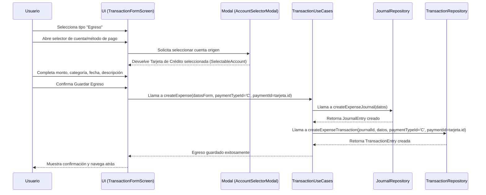
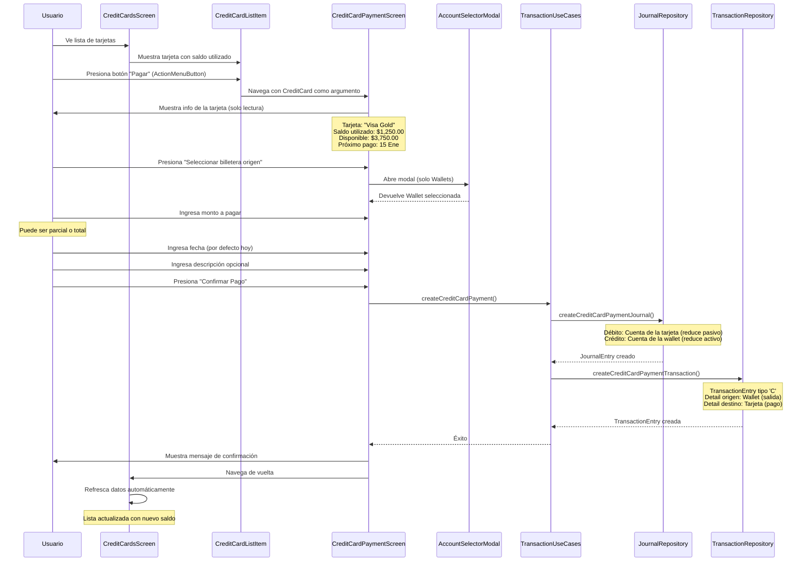

# Gestión de Tarjetas de Crédito

## 1. Visión General

Este documento describe la funcionalidad completa relacionada con las tarjetas de crédito dentro de la aplicación MoneyT, abarcando:
-   Registro y gestión de tarjetas de crédito.
-   Uso de tarjetas de crédito como método de pago en transacciones de egreso.
-   Proceso dedicado para el pago de tarjetas de crédito.

## 2. Estado Actual de Implementación

### ✅ **IMPLEMENTADO:**
-   **Gestión básica de tarjetas:** CRUD completo (`CreditCardsScreen`, `CreditCardFormScreen`, `CreditCardUseCases`, `CreditCardRepository`).
-   **Uso en transacciones de egreso:** Las tarjetas pueden seleccionarse como método de pago en gastos a través de `AccountSelectorModal`.
-   **Integración contable:** Los gastos con tarjeta generan correctamente asientos contables (débito a categoría de gasto, crédito a cuenta contable de la tarjeta).

### 🔄 **POR IMPLEMENTAR:**
-   **Pantalla dedicada para pago de tarjetas:** `CreditCardPaymentScreen`
-   **Flujo de pago desde lista de tarjetas:** Botón "Pagar" en `CreditCardListItem`
-   **Casos de uso específicos:** `TransactionUseCases.createCreditCardPayment()`
-   **Métodos de repositorio:** `createCreditCardPaymentJournal()` y `createCreditCardPaymentTransaction()`
-   **Cálculo de saldo utilizado:** Actualizar `getAvailableCredit()` considerando gastos y pagos
-   **Navegación:** Ruta `AppRoutes.creditCardPayment` en `RouteGenerator`

## 3. Uso de Tarjetas de Crédito en Transacciones de Egreso ✅

Las tarjetas de crédito pueden ser seleccionadas como el **método de pago** para transacciones de tipo "Egreso".

### 3.1. Flujo Técnico



### 3.2. Detalles de Implementación

-   **`TransactionFormScreen`:**
    -   Cuando el tipo de transacción es "Egreso", el `AccountSelectorModal` para la cuenta origen debe listar tanto `Wallets` como `CreditCards`.
    -   Al guardar, si la cuenta seleccionada es una `CreditCard`, se pasa `paymentTypeId='C'` y el `paymentId` correspondiente de la tarjeta a `TransactionUseCases.createExpense()`.
-   **`TransactionUseCases.createExpense()`:**
    -   Debe manejar correctamente el `paymentTypeId='C'`.
    -   Al llamar a `JournalRepository.createExpenseJournal()`, la cuenta contable a debitar (el gasto) será la de la categoría, y la cuenta a acreditar (el origen del pago) será la cuenta contable asociada a la `CreditCard` (un pasivo que aumenta).
-   **`JournalRepositoryImpl.createExpenseJournal()`:**
    -   Si el `paymentTypeId` es 'C', el asiento de crédito debe ir a la `chartAccountId` de la `CreditCard`.
-   **`TransactionRepositoryImpl.createExpenseTransaction()`:**
    -   El `TransactionDetail` para el origen del pago (`flowId='F'`) tendrá `paymentTypeId='C'` y `paymentId` de la tarjeta.

## 4. Pago de Tarjetas de Crédito (Flujo Dedicado) 🔄

### 4.1. Objetivo del Flujo
Permitir a los usuarios pagar el saldo de sus tarjetas de crédito desde sus billeteras (`Wallets`), registrando:
- Una **disminución del pasivo** (saldo de la tarjeta)
- Una **disminución del activo** (dinero de la billetera)

### 4.2. Flujo de Usuario Detallado



### 4.3. Especificaciones Técnicas Detalladas

#### 4.3.1. **CreditCardPaymentScreen**
**Ubicación:** `d:\Fuentes\moneyt\app\lib\presentation\pages\credit_cards\credit_card_payment_screen.dart`

**Constructor:**
```dart
CreditCardPaymentScreen({
  required CreditCard creditCard,
})
```

**UI Componentes:**
```dart
// Información de la tarjeta (solo lectura)
InfoSection(
  title: creditCard.name,
  items: [
    InfoItem(label: "Saldo utilizado", value: formatCurrency(usedAmount)),
    InfoItem(label: "Disponible", value: formatCurrency(availableCredit)),
    InfoItem(label: "Próximo pago", value: formatDate(nextPaymentDate)),
  ],
)

// Formulario de pago
PaymentForm(
  sourceWalletSelector: WalletSelectorButton(),
  amountField: CurrencyInputField(
    hintText: "Monto a pagar",
    suggestionButtons: [
      SuggestionButton("Pago mínimo", minPayment),
      SuggestionButton("Saldo total", totalUsed),
    ],
  ),
  dateField: DatePickerField(initialDate: DateTime.now()),
  descriptionField: TextFormField(hintText: "Descripción (opcional)"),
  confirmButton: ElevatedButton("Confirmar Pago"),
)
```

#### 4.3.2. **TransactionUseCases.createCreditCardPayment()**
**Ubicación:** Agregar al archivo existente `transaction_usecases.dart`

**Método:**
```dart
Future<TransactionEntry> createCreditCardPayment({
  required DateTime date,
  String? description,
  required double amount,
  required String currencyId,
  required int sourceWalletId,
  required int targetCreditCardId,
  required String targetCurrencyId,
  double targetAmount, // Para manejar conversión de moneda
  double rateExchange = 1.0,
}) async {
  // 1. Obtener información de la wallet origen y la tarjeta destino
  final sourceWallet = await _walletRepository.getWalletById(sourceWalletId);
  final targetCreditCard = await _creditCardRepository.getCreditCardById(targetCreditCardId);
  
  if (sourceWallet == null || targetCreditCard == null) {
    throw Exception('Wallet origen o tarjeta de crédito no encontrada');
  }
  
  // 2. Calcular targetAmount si no se proporciona (para misma moneda)
  final finalTargetAmount = targetAmount ?? amount;
  
  // 3. Crear diario contable
  final journalEntry = await _journalRepository.createCreditCardPaymentJournal(
    date: date,
    description: description ?? 'Pago tarjeta ${targetCreditCard.name}',
    amount: amount,
    currencyId: currencyId,
    sourceWalletChartAccountId: sourceWallet.chartAccountId,
    targetCreditCardChartAccountId: targetCreditCard.chartAccountId,
    targetCurrencyId: targetCurrencyId,
    targetAmount: finalTargetAmount,
    rateExchange: rateExchange,
  );
  
  // 4. Crear transacción
  return _transactionRepository.createCreditCardPaymentTransaction(
    journalId: journalEntry.id,
    date: date,
    description: description,
    amount: amount,
    currencyId: currencyId,
    sourceWalletId: sourceWalletId,
    targetCreditCardId: targetCreditCardId,
    targetCurrencyId: targetCurrencyId,
    targetAmount: finalTargetAmount,
    rateExchange: rateExchange,
  );
}
```

#### 4.3.3. **JournalRepository.createCreditCardPaymentJournal()**
**Ubicación:** Agregar al archivo existente `journal_repository.dart` (interfaz) y `journal_repository_impl.dart`

**Interfaz:**
```dart
Future<JournalEntry> createCreditCardPaymentJournal({
  required DateTime date,
  String? description,
  required double amount,
  required String currencyId,
  required int sourceWalletChartAccountId,
  required int targetCreditCardChartAccountId,
  required String targetCurrencyId,
  required double targetAmount,
  double rateExchange = 1.0,
});
```

**Implementación:**
```dart
@override
Future<JournalEntry> createCreditCardPaymentJournal({
  required DateTime date,
  String? description,
  required double amount,
  required String currencyId,
  required int sourceWalletChartAccountId,
  required int targetCreditCardChartAccountId,
  required String targetCurrencyId,
  required double targetAmount,
  double rateExchange = 1.0,
}) async {
  final secuencial = await getNextSecuencial('C'); // Card Payment
  
  final journalModel = JournalEntryModel.create(
    documentTypeId: 'C',
    secuencial: secuencial,
    date: date,
    description: description ?? 'Card payment',
    active: true,
  );
  
  final journalId = await _dao.insertJournalEntry(journalModel.toCompanion());
  
  // Asiento contable: Débito a tarjeta (reduce pasivo), Crédito a wallet (reduce activo)
  final details = [
    JournalDetailModel(
      id: 0,
      journalId: journalId,
      currencyId: targetCurrencyId,
      chartAccountId: targetCreditCardChartAccountId,
      debit: targetAmount, // Reduce el pasivo de la tarjeta
      credit: 0,
      rateExchange: rateExchange,
    ),
    JournalDetailModel(
      id: 0,
      journalId: journalId,
      currencyId: currencyId,
      chartAccountId: sourceWalletChartAccountId,
      debit: 0,
      credit: amount, // Reduce el activo de la wallet
      rateExchange: 1.0,
    ),
  ];
  
  // Manejar diferencia de cambio si las monedas son diferentes
  if (currencyId != targetCurrencyId && (amount * rateExchange) != targetAmount) {
    final difference = targetAmount - (amount * rateExchange);
    if (difference != 0) {
      details.add(
        JournalDetailModel(
          id: 0,
          journalId: journalId,
          currencyId: targetCurrencyId,
          chartAccountId: targetCreditCardChartAccountId, // Cuenta de ganancia/pérdida cambiaria
          debit: difference > 0 ? 0 : difference.abs(),
          credit: difference > 0 ? difference : 0,
          rateExchange: rateExchange,
        ),
      );
    }
  }
  
  await _dao.insertJournalDetails(details.map((d) => d.toCompanion()).toList());
  
  final journalEntry = await getJournalEntryById(journalId);
  if (journalEntry == null) {
    throw Exception('No se pudo crear el diario de pago de tarjeta');
  }
  return journalEntry;
}
```

#### 4.3.4. **TransactionRepository.createCreditCardPaymentTransaction()**
**Ubicación:** Agregar al archivo existente `transaction_repository.dart` (interfaz) y `transaction_repository_impl.dart`

**Interfaz:**
```dart
Future<TransactionEntry> createCreditCardPaymentTransaction({
  required int journalId,
  required DateTime date,
  String? description,
  required double amount,
  required String currencyId,
  required int sourceWalletId,
  required int targetCreditCardId,
  required String targetCurrencyId,
  required double targetAmount,
  double rateExchange = 1.0,
});
```

**Implementación:**
```dart
@override
Future<TransactionEntry> createCreditCardPaymentTransaction({
  required int journalId,
  required DateTime date,
  String? description,
  required double amount,
  required String currencyId,
  required int sourceWalletId,
  required int targetCreditCardId,
  required String targetCurrencyId,
  required double targetAmount,
  double rateExchange = 1.0,
}) async {
  final secuencial = await getNextSecuencial('C');
  
  final transactionModel = TransactionEntryModel.create(
    documentTypeId: 'C', // Card Payment
    currencyId: currencyId,
    journalId: journalId,
    contactId: null,
    secuencial: secuencial,
    date: date,
    amount: amount,
    rateExchange: rateExchange,
    description: description,
  );
  
  final transactionId = await _dao.insertTransaction(transactionModel.toCompanion());
  
  if (transactionId == 0) {
    throw Exception('Error al insertar la transacción de pago de tarjeta');
  }
  
  // Crear detalles: origen (wallet) y destino (tarjeta)
  final sourceDetailModel = TransactionDetailModel.create(
    transactionId: transactionId,
    currencyId: currencyId,
    flowId: 'F', // From (salida de wallet)
    paymentTypeId: 'W', // Wallet
    paymentId: sourceWalletId,
    categoryId: 0, // No aplica categoría en pagos de tarjeta
    amount: -amount, // Salida de la wallet (negativo)
    rateExchange: 1.0,
  );
  
  final targetDetailModel = TransactionDetailModel.create(
    transactionId: transactionId,
    currencyId: targetCurrencyId,
    flowId: 'T', // To (pago a tarjeta)
    paymentTypeId: 'C', // Credit Card
    paymentId: targetCreditCardId,
    categoryId: 0, // No aplica categoría
    amount: targetAmount, // Pago a la tarjeta (positivo, reduce deuda)
    rateExchange: rateExchange,
  );
  
  await _dao.insertTransactionDetail(sourceDetailModel.toCompanion());
  await _dao.insertTransactionDetail(targetDetailModel.toCompanion());
  
  final transaction = await getTransactionById(transactionId);
  if (transaction == null) {
    throw Exception('Error al crear la transacción de pago de tarjeta');
  }
  
  return transaction;
}
```

#### 4.3.5. **Actualización de CreditCardListItem**
**Ubicación:** Modificar archivo existente `credit_card_list_item.dart`

```dart
// ...existing code...
              // Opciones
              ActionMenuButton(
                options: const [
                  ActionMenuOption.pay,    // ← NUEVO
                  ActionMenuOption.edit,
                  ActionMenuOption.delete,
                ],
                onOptionSelected: (option) {
                  switch (option) {
                    case ActionMenuOption.pay:     // ← NUEVO
                      onPay();                     // ← NUEVO
                      break;
                    case ActionMenuOption.edit:
                      onTap();
                      break;
                    case ActionMenuOption.delete:
                      onDelete();
                      break;
                    default:
                      break;
                  }
                },
              ),
```

#### 4.3.6. **Cálculo de Saldo Utilizado**
**Ubicación:** Actualizar `credit_card_usecases.dart`

```dart
/// Calcula el saldo utilizado de una tarjeta de crédito
/// Considera todos los gastos hechos con la tarjeta menos los pagos realizados
Future<double> getUsedAmount(CreditCard creditCard) async {
  // 1. Obtener todos los gastos hechos con esta tarjeta
  final expenses = await _transactionRepository.getTransactionsByPaymentTypeAndId('C', creditCard.id);
  final totalExpenses = expenses
      .where((t) => t.documentTypeId == 'E')
      .fold<double>(0.0, (sum, t) => sum + t.amount.abs());
  
  // 2. Obtener todos los pagos hechos a esta tarjeta  
  final payments = await _transactionRepository.getTransactionsByCreditCardPayment(creditCard.id);
  final totalPayments = payments
      .where((t) => t.documentTypeId == 'C')
      .fold<double>(0.0, (sum, t) => sum + t.targetDetail?.amount ?? 0.0);
  
  // 3. Saldo utilizado = gastos - pagos
  return totalExpenses - totalPayments;
}

/// Calcula el crédito disponible
Future<double> getAvailableCredit(CreditCard creditCard) async {
  final usedAmount = await getUsedAmount(creditCard);
  return creditCard.quota - usedAmount;
}
```

### 4.4. Plan de Implementación por Fases

#### **Fase 1: Bases técnicas**
1. ✅ Agregar `ActionMenuOption.pay` a `ActionMenuButton`
2. ✅ Agregar métodos en interfaces de repositorios
3. ✅ Implementar métodos en repositorios
4. ✅ Agregar método en `TransactionUseCases`

#### **Fase 2: UI**
1. ✅ Crear `CreditCardPaymentScreen`
2. ✅ Actualizar `CreditCardListItem` para incluir opción "Pagar"
3. ✅ Actualizar `CreditCardsScreen` para manejar navegación
4. ✅ Añadir ruta en `RouteGenerator`

#### **Fase 3: Lógica de saldos**
1. ✅ Implementar `getUsedAmount()` y actualizar `getAvailableCredit()`
2. ✅ Actualizar UI para mostrar saldos reales
3. ✅ Añadir métodos de consulta necesarios en `TransactionRepository`

#### **Fase 4: Validaciones y pulimiento**
1. ✅ Validaciones de saldo suficiente en wallet
2. ✅ Manejo de errores y feedback al usuario
3. ✅ Soporte para monedas diferentes
4. ✅ Tests unitarios

## 5. Consideraciones Adicionales

### 5.1. **Tipos de Documento**
- **'I'** - Income (Ingresos)
- **'E'** - Expense (Gastos con tarjeta ya implementado)
- **'T'** - Transfer (Transferencias)
- **'C'** - Card Payment (Pago de Tarjeta de Crédito por implementar)

### 5.2. **Flows en TransactionDetail**
- **'F'** (From) - Salida de wallet en pagos
- **'T'** (To) - Entrada/pago a tarjeta de crédito

### 5.3. **PaymentTypeId**
- **'W'** - Wallet
- **'C'** - Credit Card

### 5.4. **Validaciones Importantes**
- Saldo suficiente en wallet origen
- Monto mayor a cero
- Tarjeta de crédito activa
- Manejo correcto de conversiones de moneda

### 5.5. **Diferenciación de Campos**
Es importante notar que no hay conflicto entre:
- `transactions.documentTypeId = 'C'` (Card Payment - tipo de transacción)
- `transaction_details.paymentTypeId = 'C'` (Credit Card - tipo de cuenta)

Son campos diferentes que identifican conceptos distintos:
- **documentTypeId:** ¿Qué tipo de operación es? (Pago de tarjeta)
- **paymentTypeId:** ¿Qué tipo de cuenta está involucrada? (Tarjeta de crédito)

Esta documentación actualizada proporciona una guía completa y detallada para implementar el flujo de pago de tarjetas de crédito usando el tipo de documento `'C'` (Card Payment).
