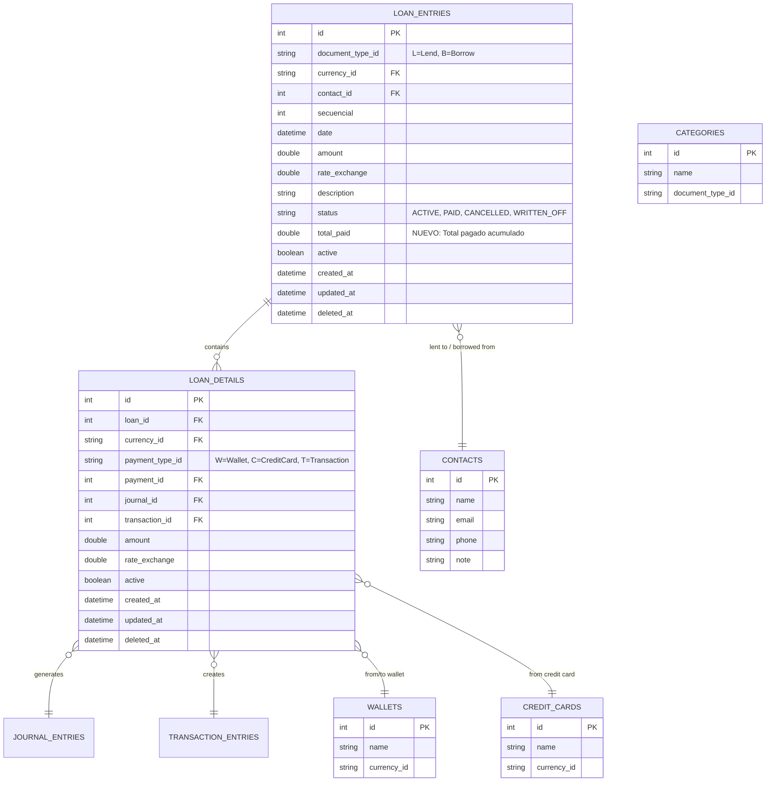
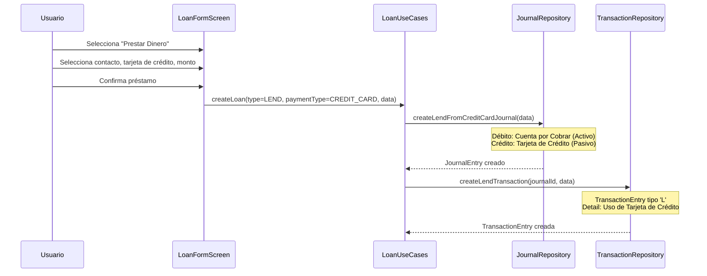
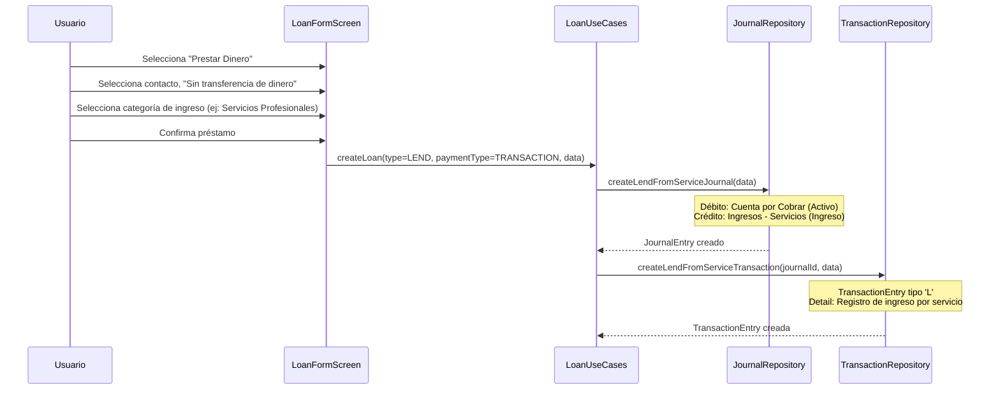
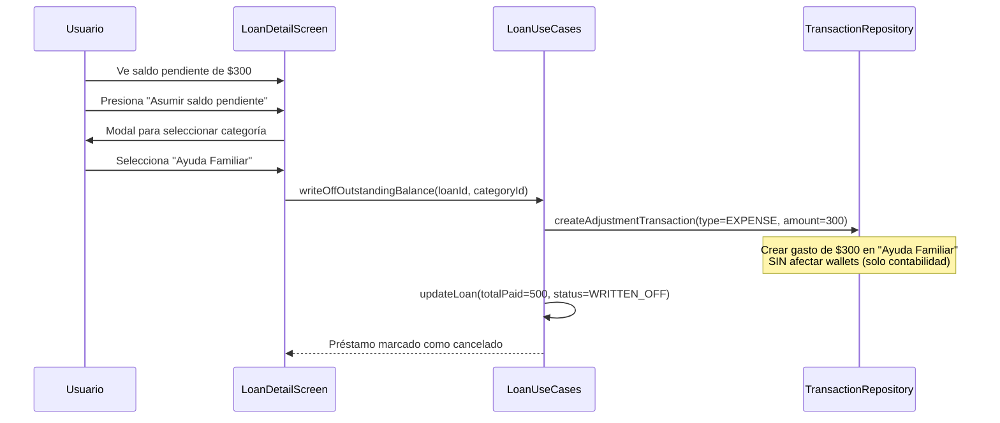
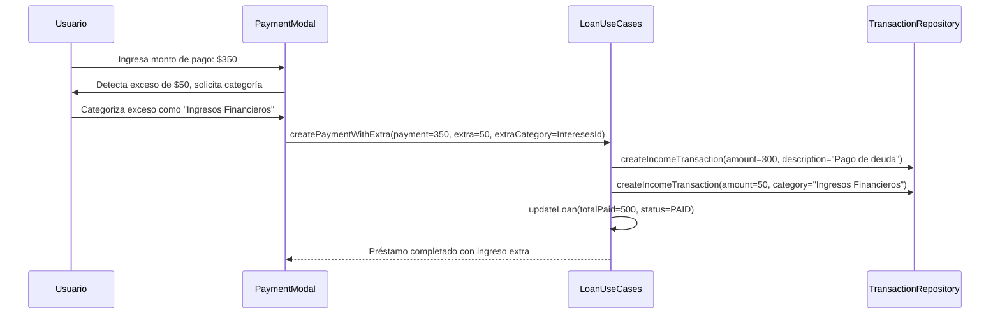
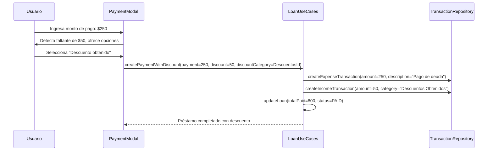

# Sistema de Gestión de Préstamos

## 1. Visión General

El módulo de préstamos de MoneyT permite gestionar tanto préstamos otorgados (dinero prestado a otros) como préstamos recibidos (dinero prestado de otros), con integración completa al sistema contable y soporte para operaciones mixtas que combinan préstamos con ingresos o gastos.

### 1.1. Características Principales

- **Préstamos Otorgados (Lend):** Dinero prestado a contactos desde wallets o tarjetas de crédito
- **Préstamos Recibidos (Borrow):** Dinero recibido de contactos hacia wallets
- **Préstamos sin Transferencia:** Registrar deudas por servicios sin movimiento de dinero físico
- **Operaciones Mixtas:** Vincular préstamos con transacciones de ingreso/gasto
- **Cancelación/Asunción de Deuda:** Convertir préstamos pendientes en gastos
- **Pagos Parciales con Ajustes:** Manejar pagos incompletos, excesivos y cancelaciones de saldos
- **Integración Contable:** Generación automática de asientos contables
- **Gestión de Pagos:** Seguimiento de pagos parciales y totales
- **Multi-moneda:** Soporte para préstamos en diferentes divisas

## 2. Arquitectura del Sistema

### 2.1. Estructura de Datos



### 2.2. Tipos de Documentos

- **'L' (Lend):** Préstamos otorgados - dinero prestado a otros
- **'B' (Borrow):** Préstamos recibidos - dinero recibido de otros

### 2.3. Estados de Préstamos

- **ACTIVE:** Préstamo activo con saldo pendiente
- **PAID:** Préstamo completamente pagado
- **CANCELLED:** Préstamo cancelado sin registro contable adicional
- **WRITTEN_OFF:** Préstamo cancelado/asumido como gasto

### 2.4. Métodos de Pago

- **'W' (Wallet):** Efectivo, cuentas bancarias - CON movimiento de dinero físico
- **'C' (Credit Card):** Tarjetas de crédito - CON movimiento de dinero (aumenta deuda)
- **'T' (Transaction):** Operaciones sin movimiento de dinero - SIN transferencia física, solo registro contable directo a categorías de ingreso/gasto

#### 2.4.1. Cuándo usar cada tipo:

**Tipo 'W' o 'C' (CON transferencia):**
```
Juan le presta $500 en efectivo a María
→ Dinero SALE de wallet de Juan
→ payment_type_id = 'W', payment_id = wallet_id
```

**Tipo 'T' (SIN transferencia):**
```
Juan le hace plomería a María por $500, queda debiendo
→ NO sale dinero de ninguna cuenta
→ payment_type_id = 'T', payment_id = category_id (Servicios Profesionales)
```

## 3. Casos de Uso Detallados

### 3.1. Préstamo Otorgado desde Wallet (Lend from Wallet)

#### 3.1.1. Impacto Contable
```
Débito:  Cuentas por Cobrar - [Contacto]     $XXX
Crédito: Efectivo/Banco - [Wallet]          $XXX
```

### 3.2. Préstamo Otorgado desde Tarjeta de Crédito (Lend from Credit Card)

#### 3.2.1. Flujo Básico


#### 3.2.2. Impacto Contable
```
Débito:  Cuentas por Cobrar - [Contacto]     $XXX
Crédito: Tarjeta de Crédito - [Tarjeta]     $XXX
```

### 3.3. Préstamo Otorgado sin Transferencia (Lend from Service)

#### 3.3.1. Escenario Típico
**Caso:** Juan (plomero) le hace un trabajo de $500 a María, quien no puede pagar inmediatamente

#### 3.3.2. Flujo Básico


#### 3.3.3. Impacto Contable
```
Débito:  Cuentas por Cobrar - [Contacto]     $500
Crédito: Ingresos - Servicios Profesionales $500
```

### 3.4. Préstamo Recibido hacia Wallet (Borrow to Wallet)

#### 3.4.1. Impacto Contable
```
Débito:  Efectivo/Banco - [Wallet]          $XXX
Crédito: Cuentas por Pagar - [Contacto]     $XXX
```

### 3.5. Préstamo Recibido sin Transferencia (Borrow from Service)

#### 3.5.1. Escenario Típico
**Caso:** Juan va al mecánico, le reparan el auto por $800, Juan no puede pagar inmediatamente

#### 3.5.2. Impacto Contable
```
Débito:  Gastos - Mantenimiento Vehículo    $800
Crédito: Cuentas por Pagar - [Mecánico]     $800
```

### 3.6. Gestión de Pagos Parciales y Ajustes

#### 3.6.1. Pagos Parciales Normales

**Escenario:** Préstamo de $500, pago de $200
```dart
// Estado después del pago
LoanEntry {
  amount: 500.0,        // Monto original
  totalPaid: 200.0,     // Acumulado pagado
  status: ACTIVE,       // Sigue activo
}
// Saldo pendiente = $300
```

#### 3.6.2. Cancelación de Saldo Pendiente (Write-Off)

**Escenario:** Préstamo de $500, pagado $200, cancelar $300 restantes como "Ayuda Familiar"



**Impacto Contable:**
```
Débito:  Gastos - Ayuda Familiar            $300
Crédito: Cuentas por Cobrar - [Contacto]    $300
```

#### 3.6.3. Pagos con Exceso

**Escenario:** Préstamo de $500, pagado $200, último pago de $350 ($50 extra por intereses)



**Flujo de Dinero:**
```
Entrada a Wallet: $350 total
Reducción de deuda: $300
Ingreso categorizado: $50 (Ingresos Financieros)
```

#### 3.6.4. Pagos Incompletos con Descuento

**Escenario:** Préstamo recibido de $800, pagado $500, acuerdan completar con $250 (descuento de $50)



**Flujo de Dinero:**
```
Salida de Wallet: $250
Reducción de deuda: $300 ($250 pago + $50 descuento)
Ingreso categorizado: $50 (Descuentos Obtenidos)
```

## 4. Componentes de la Aplicación

### 4.1. Capa de Dominio

#### 4.1.1. Entidades

**LoanEntry.dart**
```dart
class LoanEntry extends Equatable {
  final int id;
  final String documentTypeId; // 'L' o 'B'
  final String currencyId;
  final int contactId;
  final int secuencial;
  final DateTime date;
  final double amount;
  final double rateExchange;
  final String? description;
  final LoanStatus status; // ACTIVE, PAID, CANCELLED, WRITTEN_OFF
  final double totalPaid; // NUEVO
  final bool active;
  final DateTime createdAt;
  final DateTime updatedAt;
  final DateTime? deletedAt;
  final List<LoanDetail> details;
  
  // Entidades relacionadas cargadas
  final Contact? contact;
  
  @override
  List<Object?> get props => [id, documentTypeId, currencyId, contactId, ...];
}

enum LoanStatus { active, paid, cancelled, writtenOff }
```

**LoanDetail.dart**
```dart
class LoanDetail extends Equatable {
  final int id;
  final int loanId;
  final String currencyId;
  final String paymentTypeId; // 'W' o 'C'
  final int paymentId;
  final int journalId;
  final int transactionId;
  final double amount;
  final double rateExchange;
  final bool active;
  final DateTime createdAt;
  final DateTime updatedAt;
  final DateTime? deletedAt;
  
  @override
  List<Object?> get props => [id, loanId, currencyId, paymentTypeId, ...];
}
```

#### 4.1.2. Repositorio

**LoanRepository.dart**
```dart
abstract class LoanRepository {
  Future<List<LoanEntry>> getAllLoans();
  Future<LoanEntry?> getLoanById(int id);
  Stream<List<LoanEntry>> watchAllLoans();
  Future<LoanEntry> createLoan(LoanEntry loan, List<LoanDetail> details);
  Future<void> updateLoan(LoanEntry loan);
  Future<void> deleteLoan(int id);
  Future<List<LoanEntry>> getLoansByContact(int contactId);
  Future<List<LoanEntry>> getLoansByType(String documentTypeId);
  Future<List<LoanEntry>> getLoansByStatus(LoanStatus status);
  Future<void> createLoanPayment(
    int loanId,
    double amount,
    String paymentTypeId,
    int paymentId,
    DateTime date,
    {String? description}
  );
}
```

#### 4.1.3. Casos de Uso

**LoanUseCases.dart**
```dart
@injectable
class LoanUseCases {
  final LoanRepository _loanRepository;
  final JournalRepository _journalRepository;
  final TransactionRepository _transactionRepository;
  final ContactRepository _contactRepository;
  final WalletRepository _walletRepository;
  final CategoryRepository _categoryRepository;

  LoanUseCases(
    this._loanRepository,
    this._journalRepository,
    this._transactionRepository,
    this._contactRepository,
    this._walletRepository,
    this._categoryRepository,
  );

  // Operaciones básicas
  Future<List<LoanEntry>> getAllLoans();
  Future<LoanEntry?> getLoanById(int id);
  Stream<List<LoanEntry>> watchAllLoans();
  
  // Crear préstamos con transferencia de dinero
  Future<LoanEntry> createLendLoanFromWallet({
    required int contactId,
    required double amount,
    required String currencyId,
    required int walletId,
    required DateTime date,
    String? description,
  });
  
  Future<LoanEntry> createLendLoanFromCreditCard({
    required int contactId,
    required double amount,
    required String currencyId,
    required int creditCardId,
    required DateTime date,
    String? description,
  });
  
  Future<LoanEntry> createBorrowLoanToWallet({
    required int contactId,
    required double amount,
    required String currencyId,
    required int walletId,
    required DateTime date,
    String? description,
  });
  
  // Crear préstamos sin transferencia de dinero (por servicios)
  Future<LoanEntry> createLendLoanFromService({
    required int contactId,
    required double amount,
    required String currencyId,
    required int incomeCategoryId,
    required DateTime date,
    String? description,
  });
  
  Future<LoanEntry> createBorrowLoanFromService({
    required int contactId,
    required double amount,
    required String currencyId,
    required int expenseCategoryId,
    required DateTime date,
    String? description,
  });
  
  // Operaciones mixtas
  Future<Map<String, dynamic>> createMixedLendWithExpense({
    required int contactId,
    required double amount,
    required String currencyId,
    required int walletId,
    required int categoryId,
    required DateTime date,
    String? description,
  });
  
  Future<Map<String, dynamic>> createMixedBorrowWithIncome({
    required int contactId,
    required double amount,
    required String currencyId,
    required int walletId,
    required int categoryId,
    required DateTime date,
    String? description,
  });
  
  // Gestión de pagos simples
  Future<void> createLoanPayment({
    required int loanId,
    required double paymentAmount,
    required int walletId,
    required DateTime date,
    String? description,
  });
  
  // Gestión de pagos con ajustes (NUEVO - FUNCIONALIDAD PRINCIPAL)
  Future<void> createLoanPaymentWithAdjustment({
    required int loanId,
    required double paymentAmount,
    required int walletId,
    required DateTime date,
    // Para ajustes
    double? writeOffAmount,
    int? writeOffCategoryId,
    double? extraAmount, 
    int? extraCategoryId,
    String? description,
  });
  
  // Cancelación/Asunción de saldo pendiente (NUEVO)
  Future<void> writeOffOutstandingBalance({
    required int loanId,
    required int categoryId,
    required DateTime date,
    String? description,
  });
  
  // Métodos helper para UI
  double getOutstandingBalance(LoanEntry loan) {
    return loan.amount - loan.totalPaid;
  }
  
  bool canWriteOffLoan(LoanEntry loan) {
    return loan.status == LoanStatus.active && getOutstandingBalance(loan) > 0;
  }
  
  // Consultas especializadas
  Future<List<LoanEntry>> getLoansByContact(int contactId);
  Future<List<LoanEntry>> getActiveLends();
  Future<List<LoanEntry>> getActiveBorrows();
  Future<double> getTotalLentAmount();
  Future<double> getTotalBorrowedAmount();
  Future<double> getOutstandingLentAmount();
  Future<double> getOutstandingBorrowedAmount();
  
  // Validaciones
  Future<bool> validateLoanPayment(int loanId, double paymentAmount);
  Future<List<Category>> getAvailableIncomeCategories();
  Future<List<Category>> getAvailableExpenseCategories();
}
```

### 4.2. Capa de Datos

#### 4.2.1. Tabla

**loan_entries_table.dart**
```dart
@DataClassName('LoanEntries')
class LoanEntry extends Table {
  IntColumn get id => integer().autoIncrement()();
  TextColumn get documentTypeId => text().withLength(min: 1, max: 1)();
  TextColumn get currencyId => text().withLength(min: 1, max: 3)();
  IntColumn get contactId => integer()();
  IntColumn get secuencial => integer()();
  DateTimeColumn get date => dateTime()();
  RealColumn get amount => real()();
  RealColumn get rateExchange => real().withDefault(const Constant(1.0))();
  TextColumn get description => text().nullable()();
  TextColumn get status => text().withDefault(const Constant('ACTIVE'))();
  BoolColumn get active => boolean().withDefault(const Constant(true))();
  DateTimeColumn get createdAt => dateTime().withDefault(currentDateAndTime)();
  DateTimeColumn get updatedAt => dateTime().withDefault(currentDateAndTime)();
  DateTimeColumn get deletedAt => dateTime().nullable()();
  RealColumn get totalPaid => real().withDefault(const Constant(0.0))();
}
```

**loan_details_table.dart**
```dart
@DataClassName('LoanDetails')
class LoanDetail extends Table {
  IntColumn get id => integer().autoIncrement()();
  IntColumn get loanId => integer()();
  TextColumn get currencyId => text().withLength(min: 1, max: 3)();
  TextColumn get paymentTypeId => text().withLength(min: 1, max: 1)();
  IntColumn get paymentId => integer()();
  IntColumn get journalId => integer()();
  IntColumn get transactionId => integer()();
  RealColumn get amount => real()();
  RealColumn get rateExchange => real().withDefault(const Constant(1.0))();
  BoolColumn get active => boolean().withDefault(const Constant(true))();
  DateTimeColumn get createdAt => dateTime().withDefault(currentDateAndTime)();
  DateTimeColumn get updatedAt => dateTime().withDefault(currentDateAndTime)();
  DateTimeColumn get deletedAt => dateTime().nullable()();
}
```

#### 4.2.2. DAO

**loan_dao.dart**
```dart
@DriftAccessor(tables: [LoanEntry, LoanDetail])
class LoanDao extends DatabaseAccessor<AppDatabase> with _$LoanDaoMixin {
  LoanDao(AppDatabase db) : super(db);

  // Queries básicas
  Future<List<LoanEntries>> getAllLoans();
  Future<LoanEntries?> getLoanById(int id);
  Future<List<LoanDetails>> getLoanDetailsForEntry(int loanId);
  Stream<List<LoanEntries>> watchAllLoans();
  
  // Queries especializadas
  Future<List<LoanEntries>> getLoansByContact(int contactId);
  Future<List<LoanEntries>> getLoansByType(String documentTypeId);
  Future<List<LoanEntries>> getLoansByStatus(String status);
  
  // CRUD Operations
  Future<int> insertLoan(LoanEntriesCompanion entry);
  Future<int> insertLoanDetail(LoanDetailsCompanion detail);
  Future<bool> updateLoan(LoanEntriesCompanion entry);
  Future<int> deleteLoan(int id);
  Future<int> deleteLoanDetails(int loanId);
  
  // Utilidades
  Future<int> getNextSecuencial(String documentTypeId);
}
```

### 4.3. Capa de Presentación

#### 4.3.1. Pantallas

**LoansScreen** - Lista principal de préstamos
```dart
class LoansScreen extends StatefulWidget {
  // Pestañas: Todos, Prestados, Recibidos, Pagados
  // Lista filtrable por contacto, estado, fecha
  // FAB para crear nuevo préstamo
}
```

**LoanFormScreen** - Formulario para crear préstamos
```dart
class LoanFormScreen extends StatefulWidget {
  // Tipo de préstamo (Prestar/Pedir)
  // Selector de contacto
  // Selector de método de pago:
  //   - Para préstamos otorgados: Wallet o Tarjeta de Crédito
  //   - Para préstamos recibidos: Solo Wallet
  // Campo de monto y moneda
  // Campo de descripción
  // Toggle para operación mixta (con categoría)
  // Botón de confirmación
}
```

**LoanDetailScreen** - Detalle de préstamo específico
```dart
class LoanDetailScreen extends StatefulWidget {
  // Información del préstamo
  // Método de pago utilizado (Wallet o Tarjeta)
  // Historial de pagos
  // Botones para:
  //   - Registrar pago/cobro
  //   - Asumir como gasto (solo préstamos otorgados activos)
  //   - Cancelar (sin gasto)
  //   - Editar (solo si no tiene pagos)
}
```

#### 4.3.2. Componentes

**LoanListItem** - Elemento de lista de préstamos
```dart
class LoanListItem extends StatelessWidget {
  // Información del contacto
  // Monto y estado del préstamo
  // Fecha de creación
  // Indicador visual del tipo (Prestado/Recibido)
  // Menú de acciones
}
```

**LoanSummaryCard** - Resumen de préstamos
```dart
class LoanSummaryCard extends StatelessWidget {
  // Total prestado
  // Total recibido
  // Balance neto
  // Préstamos vencidos (futuro)
}
```

**PaymentMethodSelector** - Selector de método de pago
```dart
class PaymentMethodSelector extends StatelessWidget {
  final List<Wallet> wallets;
  final List<CreditCard> creditCards;
  final String selectedPaymentType; // 'W' o 'C'
  final int? selectedPaymentId;
  final bool isLendingOperation; // Si es true, permite tarjetas
  final Function(String, int) onPaymentMethodChanged;
  
  // Muestra wallets siempre
  // Muestra tarjetas solo si isLendingOperation = true
  // Radio buttons para tipo, dropdown para selección específica
}
```

**WriteOffModal** - Modal para cancelar como gasto
```dart
class WriteOffModal extends StatelessWidget {
  final LoanEntry loan;
  final List<Category> expenseCategories;
  final Function(int categoryId, String? description) onConfirm;
  
  // Selector de categoría de gasto
  // Campo de descripción opcional
  // Advertencia sobre la irreversibilidad
  // Botones Cancelar/Confirmar
}
```

**LoanStatusChip** - Chip de estado del préstamo
```dart
class LoanStatusChip extends StatelessWidget {
  final LoanStatus status;
  
  // Colores y textos según el estado:
  // ACTIVE: Azul "Activo"
  // PAID: Verde "Pagado"
  // CANCELLED: Gris "Cancelado"
  // WRITTEN_OFF: Naranja "Asumido como Gasto"
}
```

## 5. Flujos de Usuario Actualizados

### 5.1. Crear Préstamo Otorgado

1. **Navegación:** Usuario accede a "Préstamos" → "Prestar Dinero"
2. **Formulario:**
   - Selecciona contacto (obligatorio)
   - **Tipo de operación:**
     - ✅ "Con transferencia de dinero" → Selector de Wallet/Tarjeta
     - ✅ "Sin transferencia (por servicios)" → Selector de categoría de ingreso
   - Ingresa monto (obligatorio)
   - Ingresa descripción (opcional)
   - Opción: "También registrar como gasto" + selección de categoría
3. **Confirmación:** Review de la operación incluyendo método de pago
4. **Procesamiento:** Creación de loan, journal y transaction
5. **Resultado:** Confirmación y navegación a detalle del préstamo

### 5.2. Crear Préstamo Recibido

1. **Navegación:** Usuario accede a "Préstamos" → "Pedir Prestado"
2. **Formulario:**
   - Selecciona contacto (obligatorio)
   - **Tipo de operación:**
     - ✅ "Con transferencia de dinero" → Selector de Wallet destino
     - ✅ "Sin transferencia (por servicios)" → Selector de categoría de gasto
   - Ingresa monto (obligatorio)
   - Ingresa descripción (opcional)
3. **Confirmación:** Review de la operación
4. **Procesamiento:** Creación de loan, journal y transaction
5. **Resultado:** Confirmación y navegación a detalle del préstamo

### 5.3. Registrar Pago de Préstamo (ACTUALIZADO)

1. **Acceso:** Desde detalle de préstamo activo
2. **Modal de Pago Inteligente:**
   - **Campo principal:** "Monto a pagar/recibir"
   - **Cálculo automático:** Muestra saldo pendiente
   - **Detección de discrepancias:**
     - Si monto < saldo pendiente → Opción "Cancelar saldo restante"
     - Si monto > saldo pendiente → Opción "Categorizar exceso"
   - **Selector de wallet** para movimiento de dinero real
   - **Confirmación con preview** del impacto contable
3. **Procesamiento Automático:**
   - Creación de transacciones apropiadas
   - Actualización de totalPaid
   - Cambio de estado si corresponde
4. **Resultado:** Estado actualizado del préstamo con historial de pagos

### 5.4. Asumir Saldo Pendiente (NUEVO)

1. **Acceso:** Desde detalle de préstamo con saldo pendiente
2. **Botón:** "Asumir saldo pendiente ($XXX)"
3. **Modal de Confirmación:**
   - **Advertencia:** "Esta acción es irreversible"
   - **Monto a cancelar:** Saldo pendiente calculado automáticamente
   - **Selector de categoría:** Ingreso (para préstamos recibidos) o Gasto (para préstamos otorgados)
   - **Campo de descripción:** Opcional
4. **Procesamiento:**
   - Creación de transacción de ajuste (sin movimiento de dinero real)
   - Actualización del préstamo: totalPaid = amount, status = WRITTEN_OFF
5. **Resultado:** Préstamo marcado como cancelado, nueva entrada en categoría seleccionada

## 6. Consideraciones Técnicas Adicionales

### 6.1. Integración con Tarjetas de Crédito

Los préstamos otorgados desde tarjetas de crédito se integran con el sistema de tarjetas existente:
- Aumentan el saldo utilizado de la tarjeta
- Se consideran en el cálculo de crédito disponible
- Aparecen en el historial de transacciones de la tarjeta

### 6.2. Reportes Actualizados

- **Balance por Método de Pago:** Total prestado desde wallets vs tarjetas
- **Préstamos Cancelados:** Montos asumidos como gastos por categoría
- **Efectividad de Cobranza:** Ratio de préstamos pagados vs cancelados

### 6.3. Casos de Uso Reales Actualizados

#### 6.3.1. Préstamo con Tarjeta
**Escenario:** Juan presta $300 a María usando su tarjeta de crédito
- **Acción:** Crear préstamo otorgado con tarjeta
- **Resultado:** +$300 en cuentas por cobrar, +$300 en saldo usado de tarjeta

#### 6.3.2. Préstamo por Servicios
**Escenario:** Juan (electricista) le hace un trabajo de $150 a Pedro, quien pagará después
- **Acción:** Crear préstamo otorgado sin transferencia
- **Resultado:** +$150 en cuentas por cobrar, +$150 en ingresos por servicios

#### 6.3.3. Pago Parcial con Cancelación
**Escenario:** María debe $500 a Juan, paga $300, Juan perdona los $200 restantes
- **Acción:** Pago de $300 + write-off de $200 como "Ayuda Familiar"
- **Resultado:** +$300 en wallet, +$200 en gastos de ayuda familiar, préstamo PAID

#### 6.3.4. Pago con Intereses
**Escenario:** Pedro debe $400 a Juan, paga $450 ($50 de intereses por demora)
- **Acción:** Pago con exceso categorizado como "Ingresos Financieros"
- **Resultado:** +$450 en wallet, +$50 en ingresos financieros, préstamo PAID

#### 6.3.5. Deuda por Servicios con Descuento
**Escenario:** Juan debe $200 al mecánico, negocia pagar solo $180
- **Acción:** Pago incompleto con descuento categorizado como "Descuentos Obtenidos"
- **Resultado:** -$180 de wallet, +$20 en ingresos por descuentos, préstamo PAID

## 7. Ventajas del Sistema Actualizado

### 7.1. Flexibilidad Total
- **Préstamos tradicionales:** Con movimiento de dinero real
- **Préstamos por servicios:** Sin movimiento inicial de dinero
- **Pagos complejos:** Con ajustes, excesos y cancelaciones parciales

### 7.2. Contabilidad Precisa
- **Cada centavo categorizado:** No hay dinero "huérfano" en el sistema
- **Partida doble automática:** Todos los asientos contables se generan automáticamente
- **Trazabilidad completa:** Historial detallado de todas las operaciones

### 7.3. Casos de Uso Reales
- **Profesionales independientes:** Facturas por servicios con pago diferido
- **Préstamos familiares:** Con perdones y ajustes frecuentes
- **Negocios pequeños:** Créditos a clientes con intereses y descuentos

### 7.4. Experiencia de Usuario Simplificada
- **Detección automática:** El sistema identifica discrepancias y ofrece soluciones
- **Formularios inteligentes:** Se adaptan al tipo de operación seleccionada
- **Feedback visual:** Preview del impacto contable antes de confirmar

Esta documentación actualizada refleja un sistema de préstamos completo, robusto y flexible que maneja todos los escenarios del mundo real con la mínima complejidad técnica posible.
